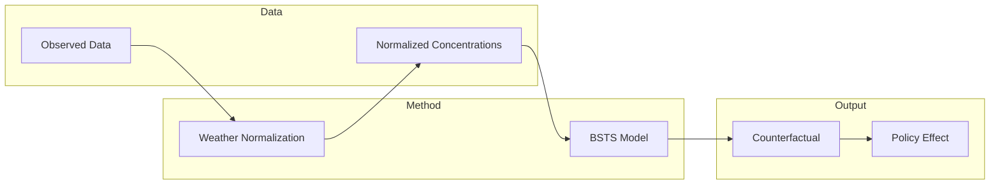

# WN_BSTS for LEZ

## Overview

This repository contains the implementation of the **Weather Normalization (WN)** method and **Bayesian Structural Time Series (BSTS)** to evaluate the impact of **Low Emission Zone (LEZ)** policies on air quality.

The analytical framework integrates machine learning–based meteorological normalization with causal inference to quantify policy effects on air pollutants.

---

## Workflow

---
## Weather Normalization (WN) – Machine Learning

The **Weather Normalization (WN)** method is used to remove meteorological variability from observed air pollution data, allowing for a clearer assessment of policy-related changes.

The implementation and methodological details of the WN component have been described previously. Please refer to the following repository for the Weather Normalization part:

[Weather Normalization code](https://github.com/tu-xuu/London_ULEZ.git)

---

## Causal Inference – BSTS

**Bayesian Structural Time Series (BSTS)** provides a causal inference framework by constructing a **counterfactual**, that is, an estimate of what would have happened in the absence of the policy intervention.

The difference between the observed outcome and the counterfactual prediction can be interpreted as the **estimated policy effect**.

Compared with methods such as **Difference-in-Differences (DiD)** or **Augmented Synthetic Control Method (ASCM)**, BSTS offers an alternative causal inference strategy when:
- no suitable control group is available, or  
- the quality of available control groups is limited.

For more details, please refer to:

[CausalImpact documentation](https://google.github.io/CausalImpact/CausalImpact.html)

---

## Example: BSTS using `CausalImpact` in R

This example demonstrates how BSTS can be used to evaluate the impact of a policy intervention on air quality.

The model estimates a counterfactual scenario representing what would have occurred in the absence of the policy. The difference between the observed series and the counterfactual prediction is interpreted as the policy effect.

The results include both point estimates and uncertainty intervals, allowing for statistical inference on the magnitude and significance of the intervention effect.

The full example code is available in this repository.

---
## References

- Brodersen KH, Gallusser F, Koehler J, Remy N, Scott SL.  
  [*Inferring causal impact using Bayesian structural time-series models.* ](http://research.google.com/pubs/pub41854.html)
  Annals of Applied Statistics, 2015, 9(1): 247–274.  
 

- Tong, C., Dai, Y., Cole, M. et al.  
  [*Further improvement in London’s air quality demands more than the Ultra Low Emission Zone policy.*](https://doi.org/10.1038/s44407-025-00030-9)    
  npj Clean Air 1, 29 (2025).

---

## Publication

The associated manuscript is currently under peer review.

## Contact

For any questions, please feel free to contact me.
